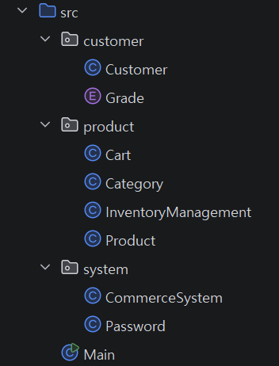
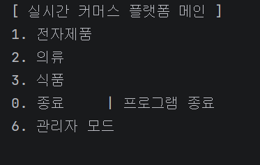
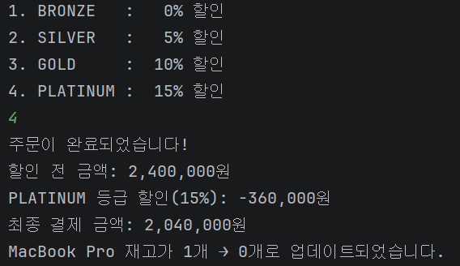
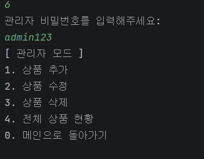
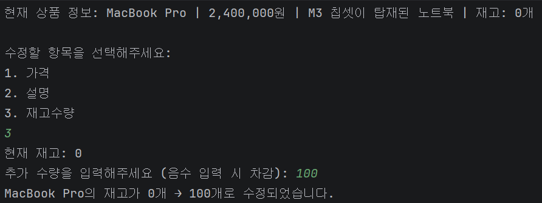

# 상품 관리 시스템

## 프로젝트 설명
자바에 익숙해지기 위한 콘솔 기반 커머스 프로젝트입니다. 객체 지향 설계에 대해 학습하고 Enum, Lambda, Stream 등을 활용하였습니다.

1. 입력에 따라 상품을 장바구니에 담고 구매해보세요!
2. 관리자 모드로 상품을 관리해보세요!
## 프로젝트 구조

## 기능
### 플랫폼 메인 - 카테고리 선택 화면

### 상품 구매 화면 - 등급별 할인

### 관리자 모드

### 관리자 모드 - 상품 수정

## 결과
과제 요구사항에 맞춰 완성하였습니다. 

피드백을 보고 캡슐화를 위해 게터를 리스트 반환에서 복사본 반환으로 수정하였고, 방어 로직에도 최대한 신경써서 코드를 작성하였습니다.

객체 지향 설계는 코드를 작성할수록 신경을 쓰지 못한 것 같아서 보충이 필요한 것 같습니다.